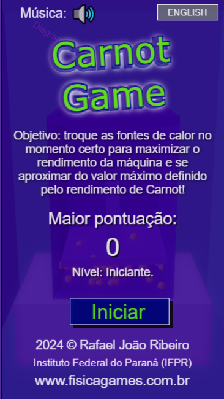
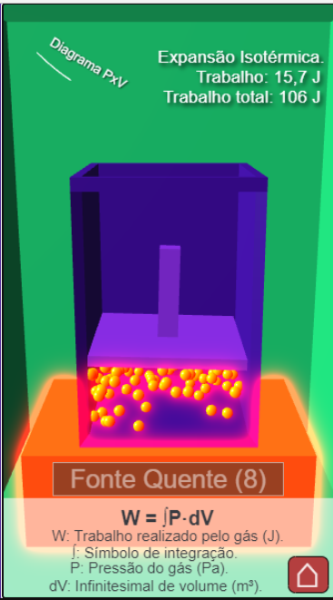
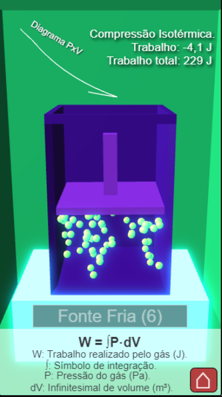
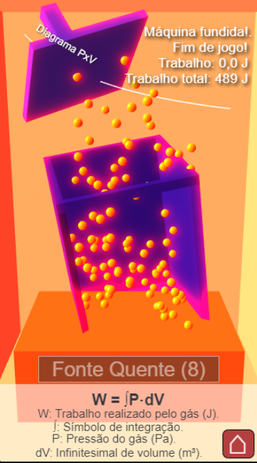

# Carnot Game 🔥❄️

[](https://opensource.org/licenses/MIT)
[](https://www.typescriptlang.org/)
[](https://www.babylonjs.com/)
[](https://vitejs.dev/)

An interactive simulation on the Carnot thermodynamic cycle, built on a custom MVC framework using Babylon.js with the Havok physics engine.

### [🎮 Play Now!](https://fisicagames.com.br/)

---

## 📄 Table of Contents

* [About the Game](#-about-the-game)
* [Key Features](#-key-features)
* [How to Play](#-how-to-play)
* [Tech Stack](#-tech-stack)
* [Installation and Setup](#-installation-and-setup)
* [Architecture and Technical Highlights](#-architecture-and-technical-highlights)
* [Screenshots](#-screenshots)
* [License](#-license)
* [Author](#-author)

---

## 📖 About the Game

**Carnot Game** is an interactive simulation based on the Carnot Cycle, in which the player alternates between three thermal reservoirs (hot, insulating, and cold) to maximize the work performed on a piston inside a cylinder. The objective is to keep the piston operating in the ideal Carnot cycle, switching reservoirs precisely to avoid both cylinder explosion (overheating) and freezing. The closer the player stays to the ideal Carnot cycle, the higher the score.

The player must time three thermodynamic transitions correctly: **isothermal expansion**, **adiabatic expansion**, **isothermal compression**, and **adiabatic compression**. The simulation is intentionally demonstrative rather than quantitative — the Carnot cycle is an idealized construct, and the game focuses on the correct sequence of processes rather than precise calculations of state variables.

---

## ✨ Key Features

* **Reservoir Switching:** A single button alternates between the hot reservoir, the cold reservoir, and the insulator.
* **Carnot-Based Scoring:** The closer the player's cycle is to the ideal Carnot cycle, the more work is generated and the higher the score.
* **Real-Time Visual Feedback:**
  * **Temperature:** Particles change color (red to blue) and velocity, reflecting temperature changes.
  * **Pressure:** The piston vibrates as internal pressure changes, driven by real particle collisions inside the cylinder.
* **Score Levels and Titles:**
  * 499–: 🐣 Beginner
  * 500–539: 🧐 Curious Student
  * 540–579: 📘 Diligent Student
  * 580–619: ✏️ Early Undergraduate
  * 620–659: 📚 Dedicated Undergraduate
  * 660–699: 🧑‍🏫 Physics Teacher
  * 700–709: 🔥 Thermodynamics Teacher
  * 710–719: 🧠 Physics Genius
  * 720+: ⚙️ Nicolas Léonard Sadi Carnot
* **Limited Switches:** The player can perform up to 9 reservoir switches, with the last switch causing an explosion if it is the hot reservoir.
* **Multilingual:** Native support for Portuguese and English.

---

## 🕹 How to Play

**Objective:** Perform precise reservoir switches to maximize the work generated and prevent the piston from getting stuck or the cylinder from exploding.

#### Controls

💻 **On PC:**

* **[ Spacebar ]** : Switch between thermal reservoirs.

📱 **On Mobile / Touch:**

* **[ Tap ]** the on-screen button to switch reservoirs.

#### Challenges

* **Reservoir Switching:** Up to 9 switches available; the last switch causes an explosion if it is the hot reservoir.
* **Piston Jamming:** The piston can get stuck at maximum or minimum volume limits if switching is not timed correctly.
* **Score:** Points are awarded based on how closely the cycle approaches the ideal Carnot cycle.

You can switch between **Portuguese** and **English** using the button in the top-right corner.

---

## 🛠 Tech Stack

| Tool                                       | Version | Description                                                              |
| ------------------------------------------ | ------- | ------------------------------------------------------------------------ |
| [TypeScript](https://www.typescriptlang.org/) | 5.7.2   | Core language, providing type safety and robust architecture.            |
| [Babylon.js](https://www.babylonjs.com/)      | 7.5.0   | Graphics engine for 3D rendering, animations, particles, and GUI system. |
| [Havok](https://www.havok.com/)               | latest  | Physics engine for realistic rigid-body interactions.                    |
| [Vite.js](https://vitejs.dev/)                | 5.2.11  | Build tool for ES6 module compilation, tree-shaking, and optimization.   |
| [Node.js](https://nodejs.org/en)              | 20+     | Development environment and runtime.                                     |

---

## 🚀 Installation and Setup

**Prerequisites:**

* Node.js (v20 or higher)
* NPM (v10 or higher)

**Steps:**

1. Clone the repository.
2. Install dependencies:
   ```sh
   npm install
   ```
3. Start the development server:
   ```sh
   npm run dev
   ```
4. Build for production (generates the `dist` folder):
   ```sh
   npm run build
   ```

---

## 🏗 Architecture and Technical Highlights

The project uses a **custom MVC Framework written in TypeScript**, allowing the simulation to run natively in mobile browsers without requiring full-screen APIs or third-party app installations.

Data flow is organized using the **Model-View-Controller (MVC)** pattern via callbacks:

* **Model:** Combines the **Havok physics engine** with a manual thermodynamic model. The cylinder is populated with 100 particles that mimic gas behavior — their velocities are scaled with √T (where T is the current temperature reservoir), and pressure on the piston is computed from real-time particle collisions. A defensive velocity-clamping technique prevents particles from passing through cylinder walls between time steps.
* **View:** Constructs the interface via Babylon GUI and manages reactive translations (Portuguese / English), updating the UI based on state changes. Particle color and animation respond to temperature changes in real time.
* **Controller:** Processes input events and triggers reservoir transitions, propagating temperature changes to the particle system.

The result is an interactive demonstration of thermodynamic cycles rather than a quantitative simulation — students experience the qualitative behavior of an idealized cycle without being burdened by exact state-variable calculations.

---
## 📸 Screenshots

   

---

## 📜 License

### Source Code

The source code in this repository is licensed under the **MIT License** — see the [LICENSE](./LICENSE) file.

### Visual Assets

3D models, textures, and original visual content created by the author are licensed under **Creative Commons Attribution 4.0 International (CC BY 4.0)**.

### Audio Assets

Music and sound effects in this project are sourced from [Pixabay](https://pixabay.com/) under the [Pixabay Content License](https://pixabay.com/service/license-summary/), which permits free use including for commercial purposes.

### Third-Party Libraries

* **Babylon.js** — Apache License 2.0
* **Havok Physics** — Per vendor terms (Babylon.js distribution)
* **Vite.js** — MIT License

**Copyright © 2024 Rafael João Ribeiro.**

---

## 👨‍🔬 Author

Developed by:
**Prof. Dr. Rafael João Ribeiro**
Federal Institute of Paraná (IFPR)
[www.fisicagames.com.br](https://www.fisicagames.com.br)
